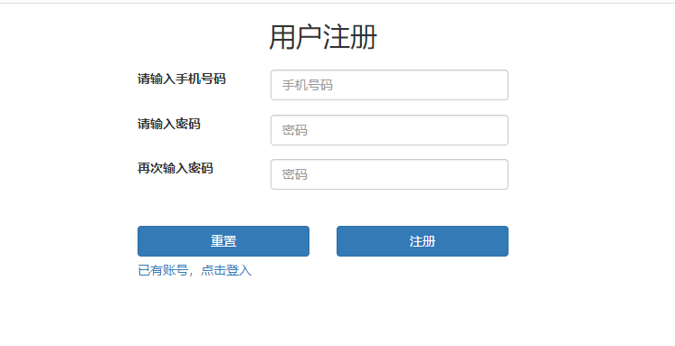
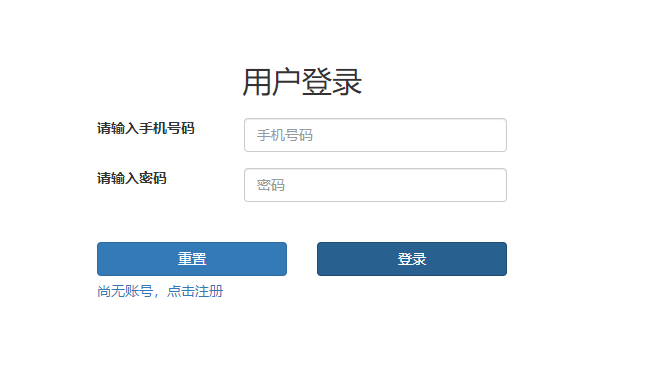
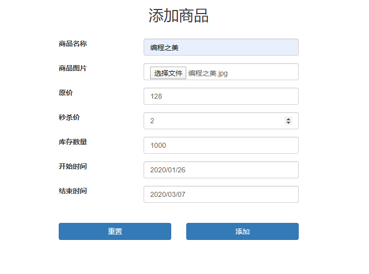
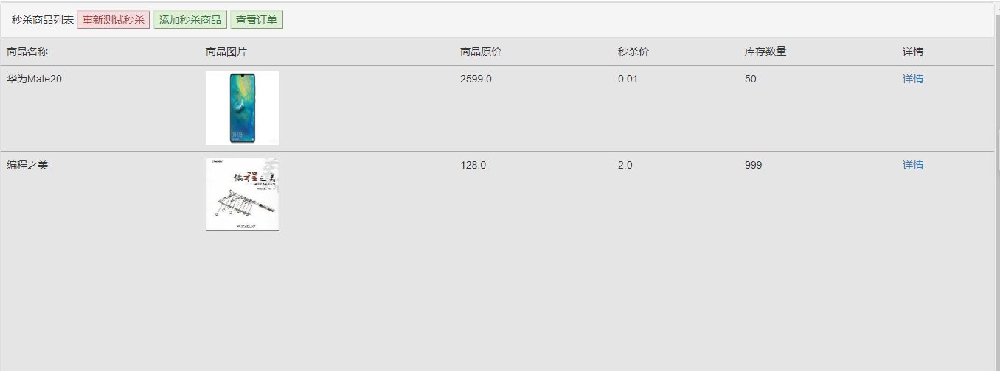
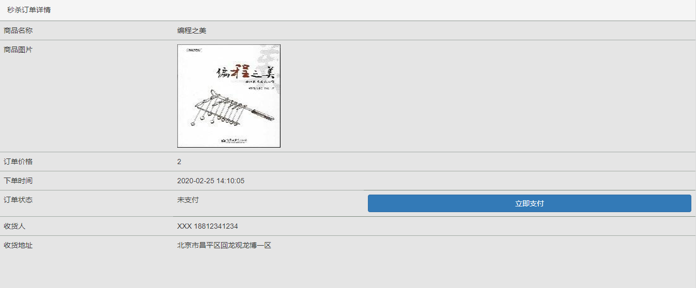
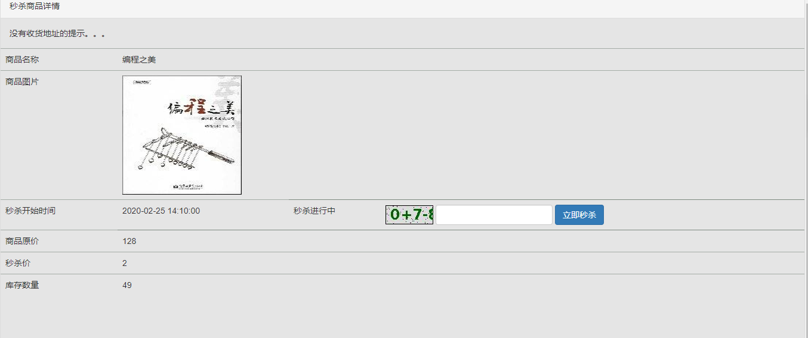

试用链接：http://wjsay.xyz:8000/

功能介绍：注册/登录、添加商品、查看商品列表、查看订单、**秒杀商品** 。

使用的技术：一个Spring Boot项目；使用Redis作缓存，存用户的Session、商品列表、秒杀商品的剩余量、部分页面；加密传输存储密码；隐藏秒杀地址；将初步判断的秒杀请求放入RabbitMQ消息队列中，排队等待处理；使用Druid数据库连接池。

1 注册

2登入

3添加商品

4商品列表

5订单详情

6秒杀界面

